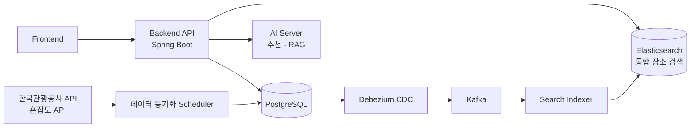
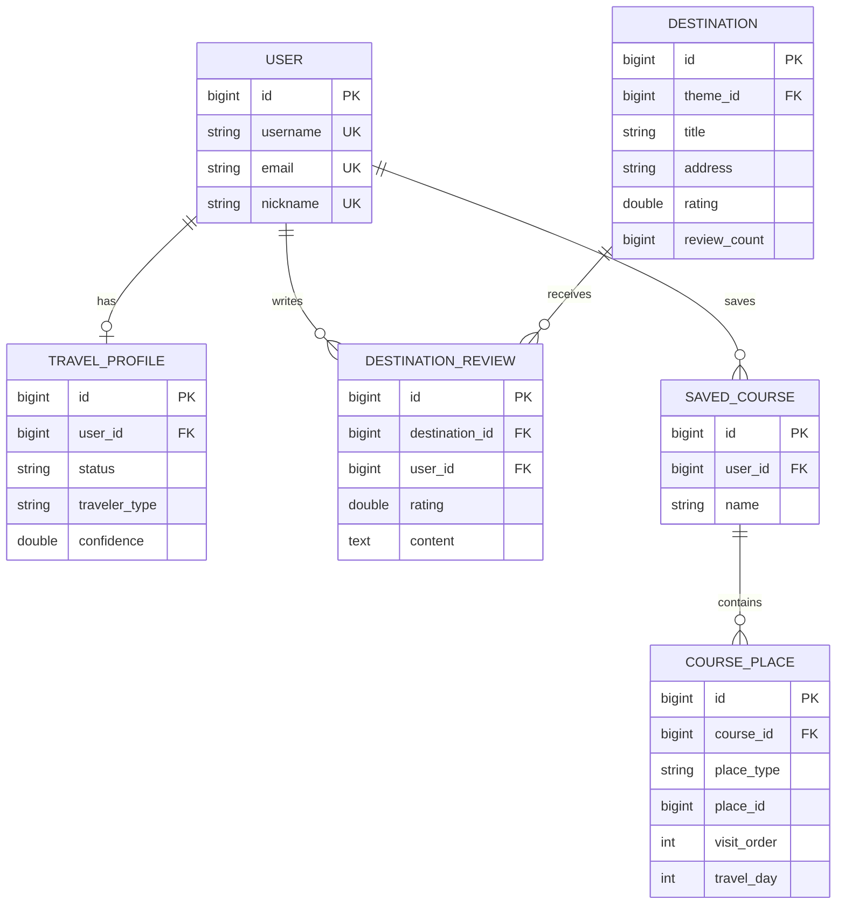

# Gangwon Companion

강원도의 여행 정보를 한곳에 모은 AI 여행 동반자 플랫폼

강원도 관광 데이터를 기반으로 관광지·맛집·숙소·체험 활동을 검색하고, 여행 조건에 맞는 AI 여행 코스와 지역 정보를 제공합니다.

## Organization Status

| 구성 | 담당 영역 |
| --- | --- |
| Backend | Spring Boot 기반 REST API, 도메인별 서비스 및 데이터 관리 |
| AI / Recommendation | 여행 조건 기반 AI 코스 추천 및 외부 AI 서버 연동 |
| Search | RDB·Elasticsearch·임베딩 기반 통합 장소 검색 및 검색 품질 개선 |
| Data Engineering | 한국관광공사·혼잡도 API 데이터 수집 및 주기적 동기화 |
| Infrastructure | Docker Compose, PostgreSQL, Kafka, Debezium, AWS S3, 모니터링 구성 |
| Security | JWT 인증, 개인정보 AES-GCM 암호화, CAPTCHA 및 접근 제어 |

## 프로젝트 배경

강원도 여행 정보는 관광지, 맛집, 숙소, 행사 등 여러 출처에 흩어져 있어 여행자의 취향과 여행 조건에 맞는 정보를 한 번에 찾기 어렵습니다.

Gangwon Companion은 공공 관광 API와 내부 데이터를 통합하고, 여행지 탐색부터 AI 코스 추천, 리뷰와 커뮤니티 활동까지 하나의 서비스에서 제공하는 것을 목표로 합니다. 반려동물 동반 및 무장애 관광 정보를 함께 제공해 다양한 여행자의 강원도 여행을 지원합니다.

## 주요 기능

| 기능 | 설명 |
| --- | --- |
| 관광지 탐색 | 테마별 관광지 목록과 상세 정보, 이미지, 운영 정보 및 리뷰를 제공합니다. |
| 반려동물·무장애 여행 | 반려동물 동반 가능 여부와 장애인 편의시설 정보를 제공합니다. |
| 맛집 및 숙소 검색 | 지역과 조건을 기준으로 음식점과 숙박 시설을 검색하고 리뷰를 확인합니다. |
| AI 여행 코스 추천 | 여행 기간과 선호 조건을 바탕으로 강원도 여행 코스를 추천하고 저장할 수 있습니다. |
| 통합 장소 검색 | 관광지·맛집·숙소·활동 데이터를 대상으로 키워드와 지역 기반 검색을 제공합니다. |
| 핫플레이스·혼잡도 | 관광지별 혼잡도와 기간별 정보를 확인해 방문 계획을 세울 수 있습니다. |
| 체험 활동 조회 | 강원도에서 진행되는 체험 및 활동 정보를 제공합니다. |
| 커뮤니티 | 여행 게시글, 댓글, 좋아요, 저장 및 이미지 업로드를 지원합니다. |
| 데이터 자동 동기화 | 한국관광공사와 혼잡도 API 데이터를 주기적으로 수집하고 갱신합니다. |
| 보안 및 회원 관리 | 회원가입, 로그인, JWT 인증, 개인정보 암호화 및 마이페이지를 제공합니다. |

## 기술 스택

| 영역 | 사용 기술 |
| --- | --- |
| Backend | Java 17, Spring Boot, Spring Security, Spring Data JPA |
| API | Spring Web, Spring Validation, Springdoc OpenAPI |
| Database | PostgreSQL 16 |
| Search | Elasticsearch, RDB Search, multilingual-e5-small Embedding |
| AI | AI Travel Course API, Embedding Service, RAG Grounding |
| Messaging / CDC | Apache Kafka, Debezium Kafka Connect |
| Security | JWT, AES-GCM, CAPTCHA |
| Storage | AWS S3 |
| Infra / Monitoring | Docker, Docker Compose, GitHub Actions, Actuator, Prometheus |

## 저장소

| 저장소 | 역할 | 링크 |
| --- | --- | --- |
| Gangwon-Companion | 강원도 여행 플랫폼 백엔드 API 및 핵심 서비스 | [Repository](https://github.com/Gangwon-Companion/Gangwon-Companion) |
| Frontend | 여행지 탐색 및 사용자 화면 | [Repository](https://github.com/Gangwon-Companion/Gangwon-FE) |
| AI Server | AI 여행 코스 추천 및 임베딩 서비스 | [Repository](https://github.com/Gangwon-Companion/Gangwon-AI) |

## 시스템 구성



### 대표 ERD



`COURSE_PLACE.place_id`는 `place_type`에 따라 관광지·음식점·숙소를 가리키는 다형성 참조이며, 각 장소 테이블과 직접적인 외래 키를 맺지 않습니다.

## 실행 방법

```powershell
Copy-Item .env.example .env
docker compose up --build
```

애플리케이션은 `http://localhost:8080`에서 실행됩니다.

```powershell
.\gradlew.bat test
.\gradlew.bat bootRun
```

API 문서는 애플리케이션 실행 후 `/swagger-ui/index.html`에서 확인할 수 있습니다.

Made with ❤️ by Gangwon Companion Team
