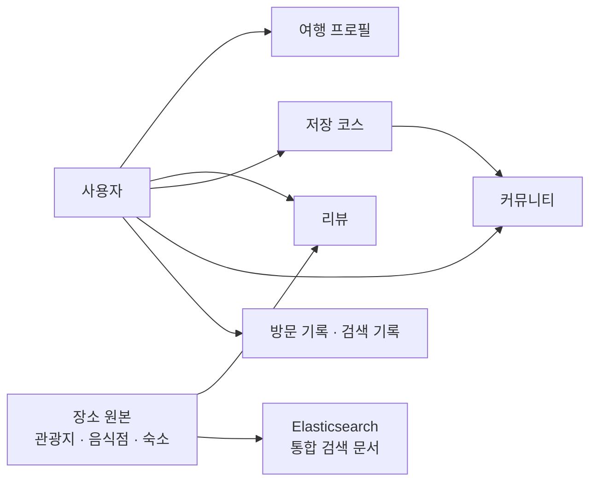
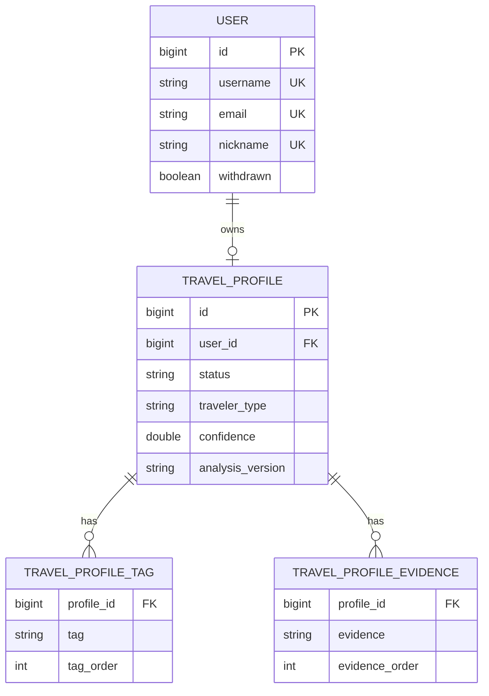
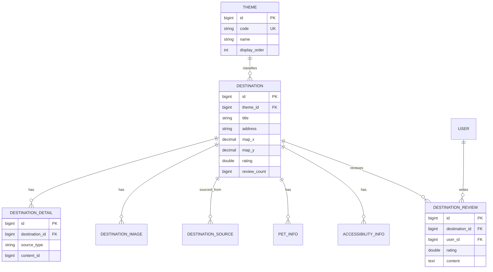
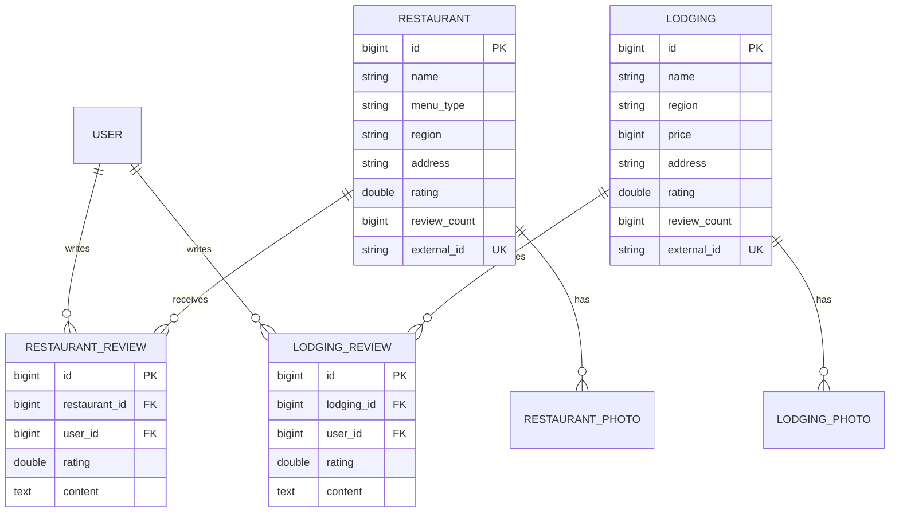
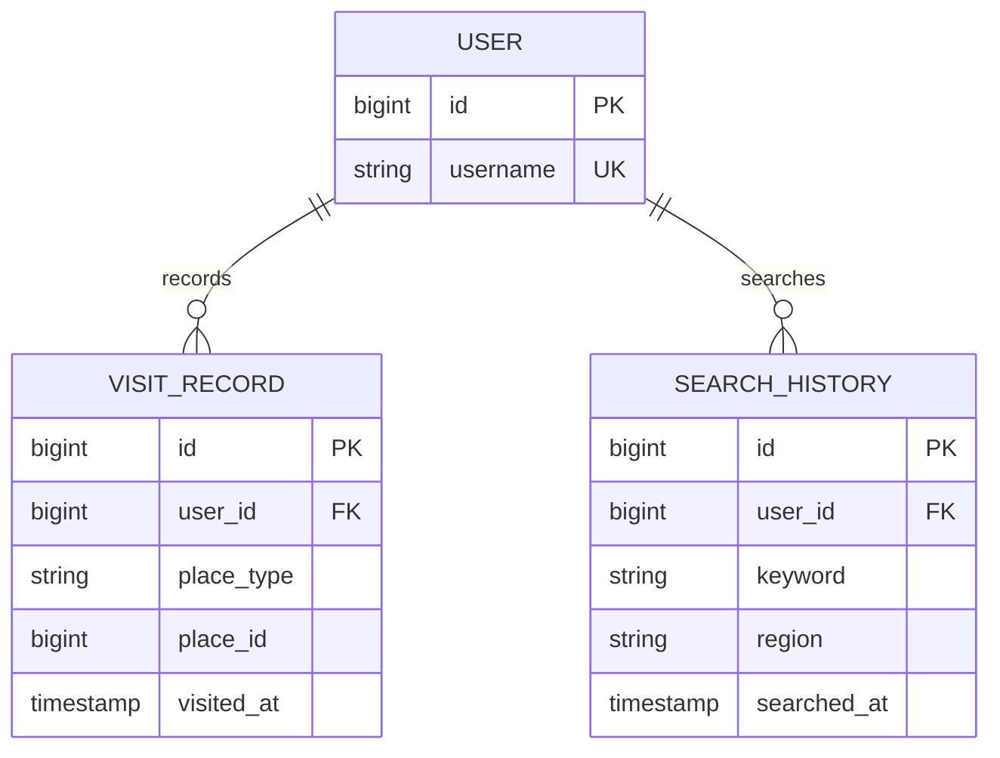
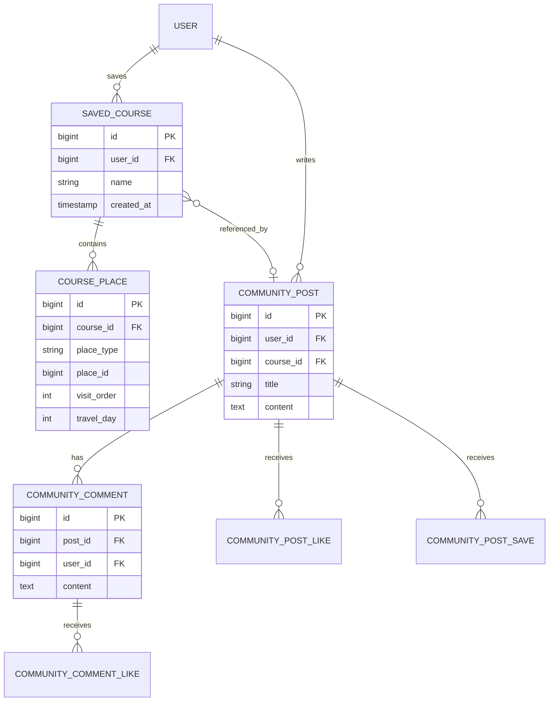
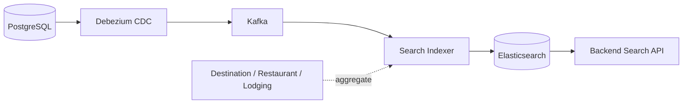

# Database ERD

Gangwon Companion 백엔드의 PostgreSQL 논리 모델과 검색 데이터 흐름을 설명하는 문서다.

이 문서는 현재 JPA 엔티티와 마이그레이션 스키마를 기준으로 관리한다. 두 정의가 다를 경우 실제 마이그레이션 스키마를 우선하며, 스키마 변경 시 이 문서도 함께 갱신한다.

## 저장소 구분

| 저장소 | 책임 | 기준 데이터 |
|---|---|---|
| PostgreSQL | 트랜잭션, 사용자 데이터, 장소 원본, 리뷰·코스 저장 | 원본 데이터(Source of Truth) |
| Elasticsearch | 통합 장소 검색, 필터링, RAG 후보 검색 | PostgreSQL에서 생성되는 파생 데이터 |

Elasticsearch 문서가 유실되더라도 PostgreSQL의 원본 데이터에는 영향이 없다. 필요하면 원본 데이터를 기준으로 재색인한다.

## 도메인 관계 개요

## 1. 사용자·여행 프로필

| 테이블 | 역할 | 핵심 제약조건 |
|---|---|---|
| `users` | 인증·사용자 식별 | `username`, `email`, `nickname` unique |
| `travel_profiles` | 사용자별 최신 여행 취향 프로필 | `user_id` unique, `users.id` 참조 |
| `travel_profile_tags` | 프로필 태그 컬렉션 | `profile_id`, `tag_order`로 순서 보존 |
| `travel_profile_evidences` | 프로필 분석 근거 컬렉션 | `profile_id`, `evidence_order`로 순서 보존 |
| `travel_profile_analysis_jobs` | AI 프로필 분석 비동기 작업 | UUID PK, `username`, `profile_id`를 작업 결과로 보유 |

`travel_profile_analysis_jobs`는 현재 `users`에 직접 FK를 맺지 않고 `username`을 저장하는 독립 작업 테이블이다.

## 2. 관광지·장소 콘텐츠

| 테이블 | 역할 | 핵심 제약조건 |
|---|---|---|
| `themes` | 관광지 분류 | `code` unique |
| `destinations` | 관광지 대표 정보 | 선택적 `theme_id` FK |
| `destination_details` | 출처별 관광지 상세 | `destination_id` FK |
| `destination_images` | 관광지 이미지 | `destination_id` FK |
| `destination_sources` | 외부 원천 식별자 | `destination_id` FK, source 정보 |
| `pet_infos` | 반려동물 동반 정보 | `destination_id` FK |
| `accessibility_infos` | 무장애 정보 | `destination_id` FK |
| `destination_reviews` | 관광지 사용자 리뷰 | `destination_id`, `user_id` FK |

## 3. 음식점·숙소 및 리뷰

| 테이블 | 역할 | 핵심 제약조건 |
|---|---|---|
| `restaurants` | 음식점 원본 정보 | `external_id` unique |
| `restaurant_reviews` | 음식점 사용자 리뷰 | 음식점·사용자 FK |
| `restaurant_photos` | 음식점 이미지 | 음식점 FK |
| `lodgings` | 숙소 원본 정보 | `external_id` unique |
| `lodging_reviews` | 숙소 사용자 리뷰 | 숙소·사용자 FK |
| `lodging_photos` | 숙소 이미지 | 숙소 FK |

관광지·음식점·숙소는 각각 원본 테이블을 유지하지만, 검색 시에는 동일한 장소 검색 문서 계약으로 통합한다.

## 4. 여행 활동·검색

| 테이블 | 역할 | 핵심 제약조건 |
|---|---|---|
| `visit_records` | 사용자 방문 이력 | `(user_id, place_type, place_id)` unique |
| `search_history` | 사용자 검색 이력 | `user_id` FK, keyword 필수 |
| `tourist_congestion_rates` | 관광지 혼잡도 시계열·외부 데이터 | 관광지·시간 기준 조회 |

## 5. 저장 코스·커뮤니티

| 테이블 | 역할 | 핵심 제약조건 |
|---|---|---|
| `saved_courses` | 사용자가 저장한 코스 헤더 | `user_id` FK |
| `course_places` | 코스의 장소·방문 순서 | `(course_id, visit_order)` unique |
| `community_posts` | 여행 커뮤니티 게시글 | 작성자 FK, 선택적 코스 FK |
| `community_comments` | 게시글 댓글 | 게시글·사용자 FK |
| `community_post_likes` | 게시글 좋아요 | `(post_id, user_id)` unique |
| `community_post_saves` | 게시글 저장 | 게시글·사용자 조합 unique |
| `community_comment_likes` | 댓글 좋아요 | `(comment_id, user_id)` unique |
| `community_post_images` | 게시글 이미지 | 게시글 FK |

## 다형성 장소 참조

`course_places.place_id`와 `visit_records.place_id`는 실제 FK가 아니라 `place_type`과 함께 해석하는 논리적 참조다.

| `place_type` | 대상 테이블 |
|---|---|
| `DESTINATION` | `destinations` |
| `RESTAURANT` | `restaurants` |
| `LODGING` | `lodgings` |

이 구조는 여러 장소 유형을 하나의 코스·활동 테이블에서 다룰 수 있다는 장점이 있지만 DB 수준의 FK 무결성을 보장하지 못한다. 따라서 다음 규칙을 애플리케이션에서 보장한다.

- 저장·수정 시 `place_type`에 맞는 대상 존재 여부를 검증한다.
- 장소 삭제 또는 비활성화 시 코스·방문 기록의 처리 정책을 함께 적용한다.
- 사용자에게 표시할 장소명·주소는 필요한 경우 `course_places`의 스냅샷 값을 사용한다.
- 새로운 장소 유형을 추가하면 `PlaceType`, 이 문서의 매핑 표, 검색 색인 로직을 함께 수정한다.

## 검색 색인 데이터 흐름

PostgreSQL이 원본 저장소이고 Elasticsearch는 검색용 파생 저장소다. 장소 변경 이벤트는 Debezium과 Kafka를 거쳐 Search Indexer가 통합 장소 문서로 반영한다. 색인 실패 시 원본 DB를 기준으로 재시도·재색인한다.
