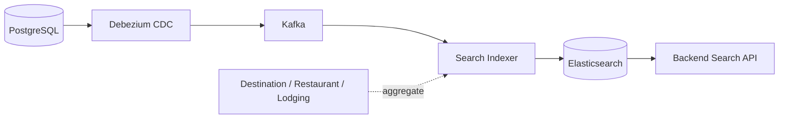

# Database ERD

이 문서는 Gangwon Companion 백엔드의 PostgreSQL 논리 모델과 주요 관계를 정리한다. README에는 핵심 흐름만 표시하고, 이 문서에서는 도메인별 테이블과 검색 데이터 흐름을 설명한다.

## 설계 원칙

- 사용자와 사용자 활동 데이터는 `users`를 중심으로 연결한다.
- 관광지·음식점·숙소 원천 데이터는 도메인별 테이블에 저장하고, 검색 시 Elasticsearch 문서로 통합한다.
- 장소 상세 정보와 외부 API 원천 정보는 기본 장소 레코드와 분리한다.
- 저장 코스의 장소는 `place_type`과 `place_id`를 사용하는 다형성 참조로 관리한다.
- 리뷰·좋아요·저장과 같은 사용자 행위 데이터는 대상 리소스와 사용자 FK를 함께 가진다.

## 전체 논리 ERD

```mermaid
erDiagram
    USER ||--o| TRAVEL_PROFILE : has
    USER ||--o{ DESTINATION_REVIEW : writes
    USER ||--o{ RESTAURANT_REVIEW : writes
    USER ||--o{ LODGING_REVIEW : writes
    USER ||--o{ VISIT_RECORD : records
    USER ||--o{ SEARCH_HISTORY : searches
    USER ||--o{ SAVED_COURSE : saves
    USER ||--o{ COMMUNITY_POST : writes

    TRAVEL_PROFILE ||--o{ TRAVEL_PROFILE_TAG : contains
    TRAVEL_PROFILE ||--o{ TRAVEL_PROFILE_EVIDENCE : contains

    THEME ||--o{ DESTINATION : classifies
    DESTINATION ||--o{ DESTINATION_DETAIL : describes
    DESTINATION ||--o{ DESTINATION_REVIEW : receives
    DESTINATION ||--o{ DESTINATION_IMAGE : has
    DESTINATION ||--o{ DESTINATION_SOURCE : sourced_from
    DESTINATION ||--o{ PET_INFO : has
    DESTINATION ||--o{ ACCESSIBILITY_INFO : has

    RESTAURANT ||--o{ RESTAURANT_REVIEW : receives
    RESTAURANT ||--o{ RESTAURANT_PHOTO : has
    LODGING ||--o{ LODGING_REVIEW : receives
    LODGING ||--o{ LODGING_PHOTO : has

    SAVED_COURSE ||--o{ COURSE_PLACE : contains
    COMMUNITY_POST }o--o| SAVED_COURSE : references
    COMMUNITY_POST ||--o{ COMMUNITY_COMMENT : has
    COMMUNITY_POST ||--o{ COMMUNITY_POST_IMAGE : has
    COMMUNITY_POST ||--o{ COMMUNITY_POST_LIKE : receives
    COMMUNITY_POST ||--o{ COMMUNITY_POST_SAVE : receives
    COMMUNITY_COMMENT ||--o{ COMMUNITY_COMMENT_LIKE : receives

    USER {
        bigint id PK
        string username UK
        string email UK
        string nickname UK
        boolean withdrawn
        timestamp created_at
    }

    TRAVEL_PROFILE {
        bigint id PK
        bigint user_id FK
        string status
        string traveler_type
        double confidence
        string analysis_version
    }

    TRAVEL_PROFILE_ANALYSIS_JOB {
        uuid id PK
        string username
        bigint profile_id
        string status
        timestamp created_at
        timestamp updated_at
    }

    TRAVEL_PROFILE_TAG {
        bigint profile_id FK
        string tag
        int tag_order
    }

    TRAVEL_PROFILE_EVIDENCE {
        bigint profile_id FK
        string evidence
        int evidence_order
    }

    THEME {
        bigint id PK
        string code UK
        int display_order
        string name
    }

    DESTINATION {
        bigint id PK
        bigint theme_id FK
        string title
        string address
        decimal map_x
        decimal map_y
        double rating
        bigint review_count
    }

    DESTINATION_DETAIL {
        bigint id PK
        bigint destination_id FK
        string source_type
        bigint content_id
    }

    DESTINATION_REVIEW {
        bigint id PK
        bigint destination_id FK
        bigint user_id FK
        double rating
        text content
    }

    RESTAURANT {
        bigint id PK
        string name
        string region
        double rating
        bigint review_count
    }

    RESTAURANT_REVIEW {
        bigint id PK
        bigint restaurant_id FK
        bigint user_id FK
        double rating
        text content
    }

    LODGING {
        bigint id PK
        string name
        string region
        double rating
        bigint review_count
    }

    LODGING_REVIEW {
        bigint id PK
        bigint lodging_id FK
        bigint user_id FK
        double rating
        text content
    }

    SAVED_COURSE {
        bigint id PK
        bigint user_id FK
        string name
        timestamp created_at
    }

    COURSE_PLACE {
        bigint id PK
        bigint course_id FK
        string place_type
        bigint place_id
        int visit_order
        int travel_day
    }

    VISIT_RECORD {
        bigint id PK
        bigint user_id FK
        string place_type
        bigint place_id
        timestamp visited_at
    }

    SEARCH_HISTORY {
        bigint id PK
        bigint user_id FK
        string keyword
        string region
        timestamp searched_at
    }

    COMMUNITY_POST {
        bigint id PK
        bigint user_id FK
        bigint course_id FK
        string title
        text content
    }

    COMMUNITY_COMMENT {
        bigint id PK
        bigint post_id FK
        bigint user_id FK
        text content
    }
```

## 도메인별 설명

### 사용자·여행 프로필

`users`가 인증 및 사용자 식별의 기준 테이블이다. `travel_profiles.user_id`는 unique 제약을 가지므로 사용자 한 명당 여행 프로필 하나를 가진다. 프로필의 태그와 근거 문장은 각각 `travel_profile_tags`, `travel_profile_evidences` 컬렉션 테이블에 저장된다.

`travel_profile_analysis_jobs`는 AI 분석 요청의 비동기 실행 상태를 저장한다. 분석 결과 자체는 `travel_profiles`에 반영되며, AI 서버가 사용자 DB를 직접 접근하지 않고 Backend API를 통해 결과를 전달한다.

### 장소·리뷰

`destinations`는 관광지의 대표 정보이고, `destination_details`, `destination_images`, `destination_sources`, `pet_infos`, `accessibility_infos`가 부가 정보를 담당한다. `restaurants`와 `lodgings`는 별도 도메인 테이블로 관리하며 각각 사진·리뷰 테이블을 가진다.

리뷰 테이블은 모두 대상 장소와 `users`를 참조한다. 리뷰가 추가되거나 수정되면 대상 장소의 평점과 리뷰 수를 갱신한다.

### 코스·활동

`saved_courses`는 사용자가 저장한 코스의 헤더이고, `course_places`는 방문 순서·일차·방문 시간과 장소 스냅샷을 저장한다. `course_places.place_id`는 `place_type` 값에 따라 관광지·음식점·숙소를 가리키며, 장소 테이블과 물리적 FK를 직접 맺지 않는다.

`visit_records`와 `search_history`는 사용자의 여행 활동 데이터로, 여행 프로필 분석 입력 수집에도 활용된다.

### 커뮤니티

`community_posts`는 작성자와 선택적인 `saved_courses`를 참조한다. 댓글·이미지·좋아요·저장 데이터는 별도 테이블로 분리하고, 좋아요와 저장 테이블은 사용자-대상 조합에 unique 제약을 두어 중복 행위를 방지한다.

## 검색 색인 데이터 흐름

PostgreSQL이 원본 저장소이며 Elasticsearch는 검색용 파생 저장소다. 장소 도메인의 변경 이벤트는 Debezium과 Kafka를 거쳐 Search Indexer가 통합 장소 문서로 반영한다. 검색 장애 시에도 원본 데이터는 PostgreSQL에 남으며, 재색인으로 Elasticsearch를 복구할 수 있다.

## 문서 유지 규칙

- 엔티티의 테이블명, PK/FK, 관계가 변경되면 이 문서를 함께 갱신한다.
- `place_type` 또는 다형성 참조 대상이 추가되면 `COURSE_PLACE`와 `VISIT_RECORD` 설명을 갱신한다.
- Elasticsearch 필드 변경은 DB ERD와 별도로 검색 문서 계약 및 색인 문서를 갱신한다.
- Mermaid ERD는 논리 모델을 위한 문서이며, 운영 DB의 모든 인덱스·제약조건을 대체하지 않는다.
