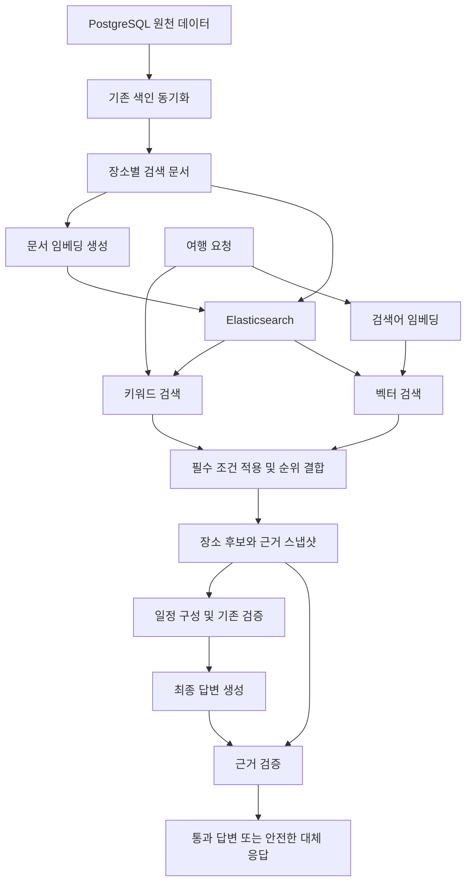

x# 하이브리드 검색 및 RAG 환각 방지 개발 계획

작성일: 2026-09-05  
상태: **설계 제안 — 개발 및 실험 실행 전**

## 1. 목적과 범위

PostgreSQL의 실제 장소 정보를 근거로 여행 코스를 제공하는 현재 구조에 의미 기반 검색과 답변 근거 검증을 추가한다. 검색 품질 개선과 환각 방지 효과를 분리해서 측정하고, 재실행 가능한 전후 비교 결과를 남기는 것이 목표다.

이 문서는 후속 개발을 위한 계획이다. 문서 작성으로 벡터 검색이나 환각 방지 기능이 구현·배포된 것은 아니다. 모델, 수치 임계값, 실행 명령은 구현 및 예비 평가 후 확정한다.

대상 저장소:

- `Gangwon-Companion`: 검색 문서, 임베딩 연계, Elasticsearch 검색 및 근거 응답
- `Gangwon-AI`: 후보·일정·최종 답변 검증, 안전한 대체 응답, 평가 실행기

## 2. 현재 구조와 확인된 한계

현재 코드 및 문서에서 확인한 내용:

- PostgreSQL이 장소 정보의 원천 DB다.
- Spring의 코스추천 API는 AI 서비스의 `/internal/travel/plan`을 호출한다.
- AI 서비스는 검색 도구를 통해 관광지·음식점·숙소 후보를 수집한다.
- 일정 구성에는 후보 기반 최적화 알고리즘이 사용된다. 모든 일정 생성 단계를 LLM 생성으로 간주하지 않는다.
- 기존 Hard Validator는 운영시간, 반려동물, 접근성, 근거 누락 등 일정 제약을 검사한다.
- 최종 자연어 설명은 설정에 따라 LLM이 작성하며, 현재 `response_llm.py`는 반환된 자유 서술을 별도 근거 검증 없이 사용한다. 호출 실패 또는 비활성화 시에는 템플릿을 사용한다.
- Elasticsearch 검색 문서에는 `dense_vector` 타입의 `embedding` 예약 필드가 있지만, 현재 검색 문서상 임베딩 생성·kNN·RRF는 후속 구현 대상이다.
- 실제 검색 엔진은 환경 설정에 따라 달라질 수 있으므로 실험 시 사용 엔진을 반드시 기록한다.

관련 자료:

- [코스추천 E2E 현황](../reports/course-recommendation-e2e-status.md)
- [Elasticsearch 장소 검색](../design/SEARCH_ELASTICSEARCH.md)
- [검색 CDC 파이프라인](../design/SEARCH_CDC_KAFKA_PIPELINE.md)
- Spring 코드: `domain/course/client/AiTravelClient.java`, `domain/search/elasticsearch/ElasticsearchIndexService.java`
- AI 코드: `app/agents/itinerary.py`, `app/tools/itinerary_optimizer.py`, `app/validators/hard_validator.py`, `app/agents/response.py`, `app/agents/response_llm.py`

RAG는 벡터 검색을 필수로 요구하지 않는다. 이번 작업에서는 검색 실패, 일정 제약 위반, 최종 문장의 근거 없는 주장을 서로 다른 오류로 다룬다.

## 3. 목표 구조

기존 Elasticsearch에 벡터 검색을 추가하는 방식을 우선 검토한다. PostgreSQL은 원천 DB로 유지한다. 별도 벡터 DB 운영은 이번 기본 범위에 포함하지 않는다.

## 4. 검색 개발 계획

### 4.1 임베딩 문서와 모델

- 장소 단위로 이름, 소개, 테마, 검색에 유효한 설명을 구성한다.
- 주소·영업시간·접근성·반려동물 정책은 원본 구조화 필드도 보존한다.
- 빈 값이나 미확인 정보를 임베딩용 문서 작성 과정에서 추정하지 않는다.
- 긴 소개를 분할할 필요가 있는지는 데이터 길이 분포를 보고 결정한다. 분할 시 장소 ID와 청크 ID를 함께 저장하고, 검색 결과는 장소 단위로 중복 제거한다.
- 한국어 검색 평가, 호출 비용, 지연시간, 사용 조건을 기준으로 임베딩 모델을 선택한다.
- 문서와 질의는 동일 모델·차원·정규화 규칙을 사용한다.
- 모델 ID·버전, 차원, 문서 해시, 원천 갱신 시각, 임베딩 생성 시각을 기록한다.

### 4.2 색인 수명주기

- 기존 장소의 일괄 임베딩을 생성하고 새 버전 색인에서 검증한다.
- 문서 해시가 바뀐 장소만 증분 임베딩한다. 삭제 이벤트는 벡터를 포함한 검색 문서에도 반영한다.
- 비동기 작업 재시도 시 과거 임베딩이 최신 문서를 덮어쓰지 않도록 원천 버전 또는 해시를 확인한다.
- 모델·차원 변경 시 새 색인에 재생성하고, 검증 후 alias를 전환한다.
- 부분 실패, 재시도, 모델 제공자 제한에 대응하는 배치 처리와 실패 기록을 제공한다.
- 임베딩이 없거나 생성에 실패한 문서도 키워드 검색 경로에서 처리할 수 있게 한다.

### 4.3 하이브리드 검색

- 동일 요청에 대해 BM25와 벡터 검색을 수행하고 RRF 등 순위 기반 방식으로 결합한다.
- Elasticsearch 버전과 라이선스에서 지원하는 결합 기능을 확인한다. 필요한 경우 애플리케이션에서 순위를 결합한다.
- 지역, 도메인, 반려동물 허용, 접근성 등 필수 조건을 두 검색 경로에 일관되게 적용하고 최종 후보에서도 검사한다.
- 필수 조건이 `null`이면 충족으로 간주하지 않는다. 요구되지 않은 조건의 미확인 값과 구분한다.
- 유사도 점수는 정책의 사실 여부나 신뢰도로 사용하지 않는다.
- 임베딩 서비스 장애 시 기존 검색으로 대체하고 실제 사용 경로와 실패 원인을 기록한다.
- 후보 수, 결합 파라미터, 관련성 기준은 튜닝 세트에서 정한다. 테스트 세트 점수에 맞춰 조정하지 않는다.

## 5. 환각 방지 개발 계획

### 5.1 요청별 근거 스냅샷

검색 응답에 장소 ID, 출처, 조회 시각, 원천 갱신 시각 또는 문서 버전, 사용 가능한 사실 필드를 포함한다. 동일 요청의 생성과 검증에는 같은 근거 스냅샷을 사용한다.

출처 ID가 있다는 사실만으로 생성 문장이 참이라고 판정하지 않는다. 인용된 근거가 해당 주장을 실제로 뒷받침하는지 확인한다. 검색 문서의 설명에 포함된 명령형 문장은 데이터로 취급한다.

### 5.2 후보 및 구조화 사실 검증

- 일정의 장소 ID가 해당 요청에서 검색된 후보에 존재하는지 확인한다.
- 장소명·주소·영업시간·동반 정책 등은 서버가 근거에서 채운다.
- 시간·정책 등의 변경과 미확인 값의 단정을 탐지한다.
- 방문 예정 시각과 영업시간을 구분하고, 이동시간 추정은 실제 측정값처럼 표시하지 않는다.
- 기존 일정 제약 검증과 연결하되, 검증 실패 이유를 별도로 기록한다.

### 5.3 최종 답변 검증과 대체 응답

- 사실 필드는 구조화된 값으로 유지하고, LLM이 표현할 수 있는 범위를 명시한다.
- 최종 설명의 사실 주장을 장소 및 근거 필드와 연결한다.
- 숫자·시간·정책은 코드로 비교한다. 자유 서술의 의미 검증이 필요하면 별도 검증 모델을 보조적으로 적용한다.
- 검증 모델의 판정은 완전한 정답으로 간주하지 않으며, 오탐·미탐을 별도 평가한다.
- 검증 실패, 시간 초과, 잘못된 응답 형식에는 검증된 사실로 만든 템플릿을 반환한다.
- 템플릿에 포함되는 추천 이유도 검증되지 않은 생성 문장을 그대로 재사용하지 않는다.
- 필수 근거 자체가 부족해 일정 확정이 불가능하면 기존 실패·미확정 응답 정책에 연결한다.

엄격한 대안으로 서버가 만든 근거 문장만 출력하는 방식을 비교할 수 있다. 다만 모든 문장을 정해진 순서로 출력하도록 강제한다면 LLM 호출의 실익이 작으므로 서버 템플릿 직접 출력을 우선 검토한다. 이 방식의 결과는 자유 서술 검증 성능과 구분해 보고한다.

## 6. 전후 비교 실험

### 6.1 비교 구성

| 구성 | 검색 방식 | 새 환각 방지 보강 |
|---|---|---|
| A: 기준선 | 기존 검색 | 미적용 |
| B | 기존 검색 | 적용 |
| C | 하이브리드 검색 | 미적용 |
| D: 최종안 | 하이브리드 검색 | 적용 |

미적용은 기존 Hard Validator까지 제거한다는 의미가 아니다. 네 구성 모두 현재 검증을 유지한다.

- A와 B: 동일 검색에서 환각 방지의 효과
- A와 C: 환각 방지 보강 없이 검색 변경의 효과
- C와 D: 하이브리드 검색에서 환각 방지의 추가 효과
- B와 D: 환각 방지를 동일하게 적용했을 때 검색 변경의 효과

실험용 비보호 경로를 운영 API에서 사용자가 임의로 활성화할 수 있게 만들지 않는다.

### 6.2 평가 데이터

초기 목표는 최소 60개 질문이며, 다음 유형을 균형 있게 구성한다. 튜닝용과 최종 평가용을 분리하고 유사 질문이 양쪽에 중복되지 않도록 관리한다.

| 유형 | 예시 및 목적 |
|---|---|
| 정확한 이름 | 특정 장소를 포함하는 요청 |
| 의미 중심 | 부모님과 무리 없이 걷기 좋은 코스 |
| 복합 필수 조건 | 지역·반려동물·접근성 결합 |
| 근거 누락 | 영업시간·실내 동반 여부 미확인 |
| 정답 없음 | 조건에 맞는 후보가 없는 요청 |
| 잘못된 정보 유도 | 존재하지 않는 장소, 무료 주차·24시간 영업 단정 유도 |

각 질문에 관련 장소와 관련성 등급, 필수 조건, 허용 가능한 응답, 근거 스냅샷을 기록한다. 정답은 검색 결과 자체를 복사해서 만들지 않고 원천 데이터와 사람의 검토로 작성한다.

### 6.3 두 종류의 테스트

1. 오류 주입 회귀 테스트
   - 존재하지 않는 장소, 허위 시간, 정책 반전, 미확인 값의 단정, 근거 ID 위조, 일정 누락·변경을 주입한다.
   - 정상 답변과 올바른 의역도 포함해 과도한 차단을 검사한다.
   - 네트워크 없이 재현할 수 있게 한다. 결과는 방어 동작 검증이며 실제 모델 환각 발생률이 아니다.
2. 실제 모델 전후 비교
   - 동일 DB 스냅샷, 질문, 생성 모델·설정, 프롬프트 버전을 고정한다.
   - 검색 변경 비교 외의 변수를 가능한 한 동일하게 유지한다.
   - 환각 방지 단독 비교에는 동일 후보 및 동일 생성 답변을 재생하는 평가도 포함한다.
   - 예비 실행에서 비용을 산정한 후 최종 평가 질문별 반복 횟수를 고정한다.
   - 답변, 검색 후보, 근거, 검증 판정, 실제 검색 경로, 지연시간 및 비용을 저장한다.
   - 구성 순서를 섞고 캐시·워밍업 조건을 기록한다. 실패 요청도 집계에서 제외하지 않는다.

### 6.4 지표 정의

| 지표 | 정의 및 주의점 |
|---|---|
| Recall@K | 정답 관련 장소 중 상위 K개에서 찾은 비율. 정답 없음 질문은 별도 집계 |
| nDCG@K | 관련성 등급을 반영한 상위 결과 순위 품질 |
| 근거 없는 주장 비율 | 근거로 지지되지 않는 사실 주장 수 / 전체 사실 주장 수 |
| 답변 단위 오류율 | 근거 없는 주장이 하나 이상 있는 답변 수 / 평가 답변 수 |
| 필수 조건 위반율 | 필수 조건을 위반한 일정 수 / 반환된 일정 수. 미확인 충족 처리도 위반으로 구분 |
| 정상 답변 차단율 | 정상으로 라벨링한 생성 답변 중 잘못 차단한 비율 |
| 일정 완성률 | 유효한 완료 일정을 반환한 요청 수 / 전체 요청 수 |
| 대체 응답률 | 템플릿으로 대체한 요청 수 / 전체 요청 수 |
| 응답시간·비용 | 전체 및 검색·생성·검증 단계별 p50/p95, 요청당 비용, 초기 색인 비용 |

사실 주장이 없는 응답을 환각률 0%의 성공으로 처리하지 않는다. 응답 보류, 실패, 템플릿 대체, 주장 개수를 함께 보고한다. 생성 직후 답변과 사용자에게 반환된 최종 답변을 각각 평가한다.

독립적인 평가 라벨과 일부 사람 검토를 사용한다. 운영 검증기의 자체 통과율을 평가 정답으로 사용하지 않는다. 표본 수와 반복 실행 변동을 보고하고, 예비 평가에서 수치 목표를 정한 뒤 최종 평가 전에 고정한다.

## 7. 구현 순서와 완료 기준

| 단계 | 작업 | 완료 기준 |
|---|---|---|
| 1 | 기준선 보존, 데이터·라벨·평가 형식 정의 | 동일 입력으로 A를 재현하고 근거·응답을 저장 가능 |
| 2 | 임베딩 및 색인 수명주기 | 일괄·증분·삭제·실패 재시도·버전 변경 검증 |
| 3 | 하이브리드 검색 | 필수 조건 일관성, 중복 제거, 장애 시 기존 검색 대체 검증 |
| 4 | 후보·사실·최종 문장 검증 | 오류 주입 차단과 정상 사례 통과, 안전한 대체 응답 검증 |
| 5 | A/B/C/D 실행기 | 고정된 설정으로 반복 실행하고 비교 산출물 생성 |
| 6 | 최종 분석 | 검색·환각·완성률·지연·비용의 변화 및 실패 사례 보고 |

테스트 통과 여부와 실제 모델 개선 여부는 별도 완료 항목이다. 최종 평가가 개선을 입증하지 못하면 개선으로 결론 내리지 않고 원인과 후속 작업을 기록한다.

## 8. 예정 산출물과 운영 고려사항

후속 개발 시 제공할 산출물:

- 검색 및 환각 방지 구현 코드와 회귀 테스트
- 평가 질문·정답·근거 스냅샷 및 버전 정보
- 오류 주입 실행기와 실제 모델 A/B/C/D 비교 실행기
- 실행 설정, 원본 응답 JSON, 집계 결과, 실패 사례 보고서
- 개발 완료 후 확정된 재실행 명령과 운영 전환·복구 절차

실제 실행 명령은 아직 존재하지 않으므로 이 문서에 실행 가능한 명령처럼 기재하지 않는다.

초기 색인 비용과 요청당 비용을 분리한다. 원문 로그에는 키·토큰 등 비밀정보를 저장하지 않는다. DB의 오래되거나 잘못된 정보는 답변 근거 검증만으로 해결되지 않으므로 원천 갱신 상태도 추적한다. 변경 색인과 기능 설정을 통해 기존 검색 및 응답 경로로 복구할 수 있게 설계한다.

## 9. 참고 자료

- [Elastic: Vector search](https://www.elastic.co/docs/solutions/search/vector): 기존 Elasticsearch에서 벡터·키워드 검색과 구조화 필터를 함께 활용하는 방향
- [Elastic: Hybrid search](https://www.elastic.co/docs/solutions/search/hybrid-search): 키워드와 벡터 검색 결합
- [Microsoft: Groundedness detection](https://learn.microsoft.com/en-us/azure/ai-services/content-safety/concepts/groundedness): 제공된 근거와 생성 답변의 일치 여부를 검사하는 접근

외부 기능의 실제 API·버전·라이선스 조건은 구현 시 다시 확인한다.
